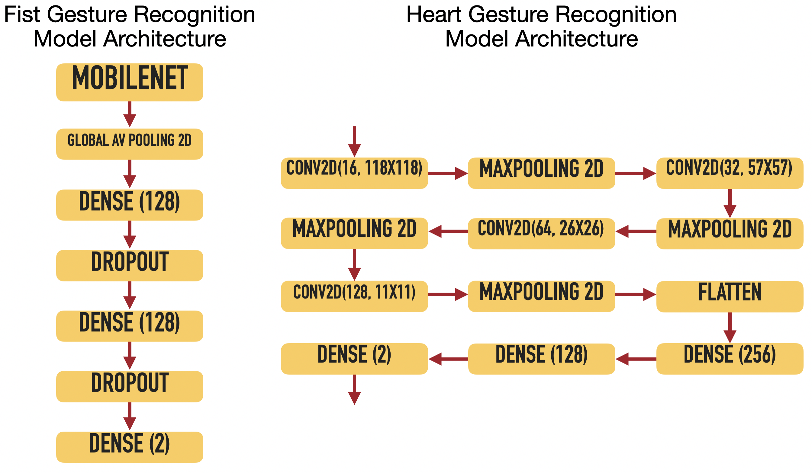

# FlowVision

    

## Group:

- ####  Andrea Arosio &nbsp;([@andreaarooo](https://github.com/andreaarooo))  10741332 &nbsp;&nbsp; andrea7.arosio@mail.polimi.it

- ####  Davide Lorenzi &nbsp;([@DavideTommy](https://github.com/DavideTommy))  10502570 &nbsp;&nbsp; davide1.lorenzi@mail.polimi.it

- ####  Enrico Torres &nbsp;([@enry1897](https://github.com/enry1897))  10712642 &nbsp;&nbsp; enrico.torres@mail.polimi.it

- ####  Filippo Marri &nbsp;([@filippomarri](https://github.com/filippomarri))  10110508 &nbsp;&nbsp; filippo.marri@mail.polimi.it

## Demo
To watch the demo of the software, click on the image below.
 

  

 

## Project description
The main claim of our project is to create a system that allow people with visual impairments to control stage effects consciously. We use a camera to detect performers' gestures by using a machine learning algorithm to easily perform it. Then we send OSC messages to communicate with RaspberryPi to controll a feedback glove that vibrate in different way according to the type of data that we have detected. Last step we communicate with lights and other stage machine in order to obtain the desirable effect.

### How to start the project
 - **Preliminary step**: Make sure that the OSC receiver of the Lighting software is set on the port and IP Address written in the code
 - **Step 0**: Make sure to have created a new environment with all the requirements
 - **Step 1**: Run the C++ code using QT framework on RaspberryPi
 - **Step 2**: Plug the Intel RealSense camera to the computer that will run the code
 - **Step 3**: Run the Python code (for Mac users mandatory using sudo)
 - **Step 4**: Click on the local host link that appears on the terminal
 - **Setp 5**: Press "Avvia" button on the interface
 - **Step 6**: HAVE FUN!
 - **Final step**: To close the application, press "ctrl + C" on the terminal

## Technology used
### List of device used and programming languages
  - Intel RealSense D435
  - RaspberryPi5
  - Python
  - C++

### Python environment
Python 3.12.10 has been used to run notebooks and model.
Tensorflow 2.19.0 and Keras 3.9.2 is used for the machine learning part. Additionally, following libraries were also installed for some specific audio-processing tasks:

* h5py 3.13.0    
* imageio 2.37.0
* mediapipe 0.10.21
* numpy 1.26.4
* pyrealsense2-macosx 2.54.2
* flask 3.1.1

### Classifiers Architecture
The two AI model proposed are two netowrks able to recognise two gestures.

 - **Fist gesture**: this network is implemented following a transfer learning approach. The original network adapted is MobileNet. Since the image given as input to this model have different backgrounds, a high number of parameters is required.

  - **Heart gesture**: this network is implemented following a transfer learning approach. The original network adapted is MobileNet. Since the image given as input to this model have simpler backgrounds with respect to the previous one, less parameters are required.

Below, the two architectures are reported.

    

### RaspberryPi description and set-up
The RaspberryPI communicates via GPIO ports to analog 3.3V relays. This intermediate step is needed since RaspberryPI has limited current output through GPIO ports, not enough to supply properly the small motors used for the aptic feedback. The source code of OSCServer can be opened, compiled and run with QtCreator or VSCode with QtPlugin. Is also possible to launch the executable just navigating with console into the main folder in which there is the file and launch it with the following command ./OSCServer. In order to connect the RaspberryPI bodypack and the glove is also required a standard ethernet cable with 4 twisted pairs. Please note that for the current alpha developement we used a static hardcoded IP 192.168.1.19 for RaspberryPI, and so for the OSCServer. The same is applyed to the OSCServer port. The static IP is warmly recommended. If you desire to change the IP on your RaspberryPI, a correction into code and a rebuild of the project is necessary. Further improvements on the GUI will introduce more user friendly interactions and services.

## Challenges & lessons learned
- Incompatibility between Python libraries on Raspberry Pi made it difficult to maintain a stable development environment.  
- Persistent integration issues between Intel RealSense and macOS limited full cross-platform support.  
- MediaPipe struggled in low-light, low-contrast, and high-motion conditions; this was addressed through image pre-processing and by implementing a fallback code.
- The lack of publicly available datasets for sequential gesture recognition led us to abandon RNN-based models in favor of CNNs triggered by threshold-based outputs from MediaPipe.  
- Updating libraries caused incompatibility with previously trained models; we resolved this by defining a consistent [requirements.txt](Core/requirements.txt) file to ensure environment reproducibility.  
- No dataset existed for the “hands on heart” gesture, so we created our own by merging and annotating data from multiple existing datasets.  
- Docker was explored for unified deployment across platforms, but macOS restrictions prevented access to external devices such as Intel RealSense within containers.  
- Gesture-triggered refreshes in the application caused light flickering, which was mitigated using a hysteresis mechanism inspired by sample-and-hold logic.  
- Due to long shipping times, we could not manufacture a custom PCB and instead used relays as a practical workaround.  
- A motor wire broke and could not be repaired due to the absence of a soldering pad, and no replacement arrived in time — the issue remained unsolved.

## Repository structure and file list
- *Core*:
  >[main.py](Core/main.py): main of the final version of the project.

  >[app.py](Core/app.py): launcher of the project. **Script that have to be run to start the software.**

  - *Legacy*:
      Hackathon version of the code without neural network
      >[FlowVision.py](Core/Legacy/FlowVision.py): main to be run to start the Hackathon version of the project.

  - *ML*:
    Machine learning models
    >[cuoricini_ep_40.h5](Core/ML/cuoricini_ep_40.h5): conv2D netwotk trained to identify the hand gesture. Used in the main code.

    >[modello_Python_aggiornato.h5](Core/ML/modello_Python_aggiornato.h5): MobileNet netwotk trained to recognize the fist gesture. Used in the main code.

    >[modello_debole_solo_sfondo_neutro.h5](Core/ML/modello_debole_solo_sfondo_neutro.h5): first attempt of MobileNet netwotk trained to recognize the fist gesture. Not used in the code.

    >[modello_performante.h5](Core/ML/modello_performante.h5): best Neural Netowrk that recognizes the fist gesture but working only with older versions of Keras (2.12) and Tf (2.12). Not used in the code.

- *Auxiliar*:
    in this fold, the jupyter notebooks to train the neural networks are reported.
    >[Fist_Neural_Net](Auxiliar/Fist_Neural_Net.ipynb)

    >[Heart_Neural_Net](Auxiliar/Heart_Neural_Net.ipynb)

- *OSCServer:*
  in this fold, the scripts for the RaspberryPi5 are contained .
  >[OSCServer.pro](OSCServer/OSCServer.pro): to open the project in QT Creator.

  >[OSCServer](OSCServer/OSCServer): compiled filed to be run on the Konsole.

- *TestingOsc:*
  Python Scripts to test the OSC receiver and client.

- *Processing:*
  in this fold the Processing script used for the Hackathon presentation is contained.

- *Deliveries:*
  KeyNote presentations, pdf presentations, and pictures for the readme.
  - *Images*: Thumbnail image and 3 pictures in 1024x768

